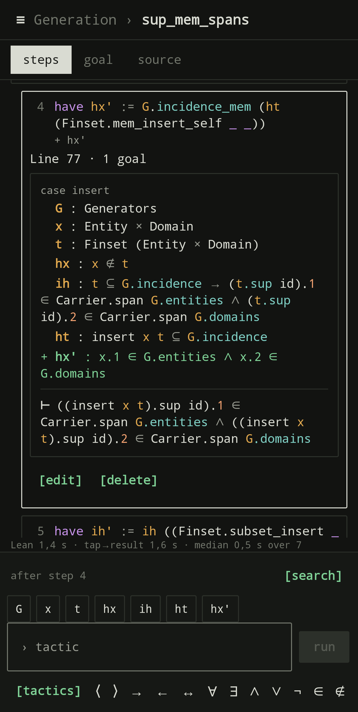
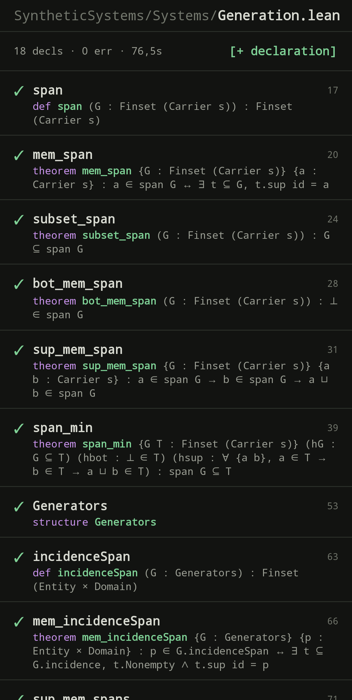

# Lean Workbench

A phone-first Android app for writing Lean 4 proofs.

Lean's editors assume a desktop. On a phone the useful unit is not the file but
the step: what this tactic did, and what is left to prove. The app is built
around that. A proof is a list of steps, each tactic a card, and the goal after
the selected step is one tap away. Checks run against the real Lean and
Mathlib, in Termux on the same phone, through the
[LeanMCP](https://github.com/richard-schmidt/LeanMCP) bridge.

<p>


</p>

The app works on the Lake packages under `~/LeanProjects`. Android cannot run
Termux's binaries, so the app talks to `bridge.py` (`~/LeanProjects/lean-mcp`)
over `127.0.0.1`, which owns warm Lean servers.

## Bridge

The bridge (`bridge.py`, `start-bridge.sh`) belongs to
[lean-mcp](https://github.com/richard-schmidt/LeanMCP), a separate project that
runs in Termux beside the app. The app needs it running to do
anything.


The app starts `~/LeanProjects/lean-mcp/start-bridge.sh` through Termux's `RUN_COMMAND`
(needs `allow-external-apps = true` in `~/.termux/termux.properties` and the "Run commands
in Termux environment" permission, asked on first tap):
- Unpaired: `[start + pair]` starts it and sends the pairing link; accept it in the app.
- Paired: on launch, if the bridge is down, the app starts it once and polls `/v1/health`
  for up to 20 s; otherwise `[start bridge]`.
- `[copy command]`: `bash ~/LeanProjects/lean-mcp/start-bridge.sh --detach [--pair]`.

## Screens

- **Libraries** (landing): one tab per package with its Lean version, git state and last CI
  run. Libraries are cards: one cell per file (proved, sorry, not built, root), counts,
  `[resume]` (last declaration opened), unsaved edits; `[open]` shows its folder tree.
  `+ lean_lib` adds a library to `lakefile.toml`. `requires` lists dependencies read-only.
- **Files**: the library's folders (fold state remembered), each file with its title,
  declaration and `sorry` counts and role; `+ file` creates a source and registers its
  import in the library root.
- **File**: declarations with statement and status (✓ proved, … sorry, ✕ error);
  `+ declaration` opens a skeleton (theorem, lemma, def, structure, class, inductive,
  namespace, section, notation form).
- **Declaration**, three views (remembered); ≡ opens the file's declarations:
  - Steps: one card per tactic line with what it did; the selected card shows the state after it.
  - Goal: the goal after the selected step, large; the steps as chips.
  - Source: the lines, with the line, insert and block editors.

## Proving

- The composer under Steps and Goal adds a step after the selected one, or replaces it if
  it is a `sorry` or has an error. Chips above the field: Lean's completions, else the
  goal's hypothesis names; below it, symbols or tactic snippets.
- `\`-abbreviations expand as in VS Code (the vscode-lean4 table, 1855 names, generated
  into `src/leanwb/AbbrevTable.kt` by `tools/gen_abbrev.py`), plus the project's own in
  `.leanwb/abbreviations.json`.
- `Try this` answers from `exact?`, `apply?`, `simp?`, `rw?` are listed; a tap applies one.
- **Search** (`[search]` on Files and in the composer): Loogle (formal) or LeanSearch
  (English), each hit checked in the edited file's scope: ✓ usable, ⇣ needs an import,
  ✕ not in this Mathlib. A hit can be tried on the goal, inserted (name, `exact`, `apply`,
  `rw`), have its import added, pinned to the package toolbox (chips above the tactic
  field) or opened as read-only source.
- Each check shows Lean's time, tap-to-result time and the session median.

## Colouring

Two layers: the app's scanner (`src/leanwb/Highlight.kt`) colours commands,
tactics, the declared name, holes, symbols, attributes, comments, literals and `sorry`;
Lean's semantic tokens from the last check add locals and fields. While a block is edited,
Lean's colours stay on untouched lines and return to edited ones at the next check. Goals
are coloured from their structure (hypothesis names as locals); new, changed or removed
hypotheses keep their diff colours. Typed tactics, search hits and Mathlib sources get the
scanner only.

## Edits and saving

- Edits live in the app and travel as `text` on each check. Undo steps back one edit;
  "Revert to disk" drops them all; "Save" writes through `/v1/save`, refused if the file
  changed on disk since it was loaded. The app never commits.
- Unsaved texts and typed prompts survive navigation and restarts (`drafts.json` in the
  app's files dir), per package and file. Back keeps a prompt, Cancel drops it. A kept
  prompt is anchored to its declaration and its line's text, so it follows the line when
  lines above it change. A file changed on disk after an edit asks whether to keep or
  discard the edits.
- An empty `by` block shows the goal the proof starts from; the composer adds the first
  step, indented under the `by` line.

## Look

A quiet terminal: monospace, square corners, ink on paper (light) or phosphor on black
(dark), `[word]` commands with the main action in reverse video. Icon: a join lattice;
the splash (`LatticeSplash`) draws it in 1.3 s, beats once and fades; a tap skips it.

## Layout

```
src/leanwb/                 pure Kotlin, host-tested: JSON, bridge contract, edits,
                            proof steps and diffs, input, drafts, creation, packages,
                            search, startup, colouring
src/com/leanworkbench/app/  Android: HTTP client, ViewModel, Compose UI, theme
fixtures/                   payloads recorded from the real bridge
```

## Build and test

```
./test.sh    # host JVM: src/leanwb only
./build.sh   # APK at out/apk/app-signed.apk
```

## Security

- Cleartext HTTP to `127.0.0.1` only (`res/xml/network_security_config.xml`).
- Every bridge request but `/v1/health` needs the bearer token: `#eval` runs code and any
  app can reach localhost. The token is in SharedPreferences and `~/.config/lean-bridge/token`.
- The pairing link filter has no BROWSABLE category; the app asks before accepting a pairing.
- `RUN_COMMAND` runs only the fixed start script, never a command built from input.

## About this repository

Developed in a private repository and published here as snapshot commits, so
the history is short by design.

## License

Copyright (C) 2026 Richard Schmidt.

- **Code** is licensed under the GNU General Public License, version 3 or any
  later version: see [LICENSE](LICENSE).
- **Documentation** (this README) is licensed under Creative Commons
  Attribution 4.0 International: see [LICENSE-CONTENT](LICENSE-CONTENT).
- The `\`-abbreviation table (`fixtures/abbreviations.json`, and
  `src/leanwb/AbbrevTable.kt` generated from it) comes from
  [vscode-lean4](https://github.com/leanprover/vscode-lean4) and is licensed
  under the Apache License 2.0: see
  [licenses/vscode-lean4-Apache-2.0.txt](licenses/vscode-lean4-Apache-2.0.txt).
